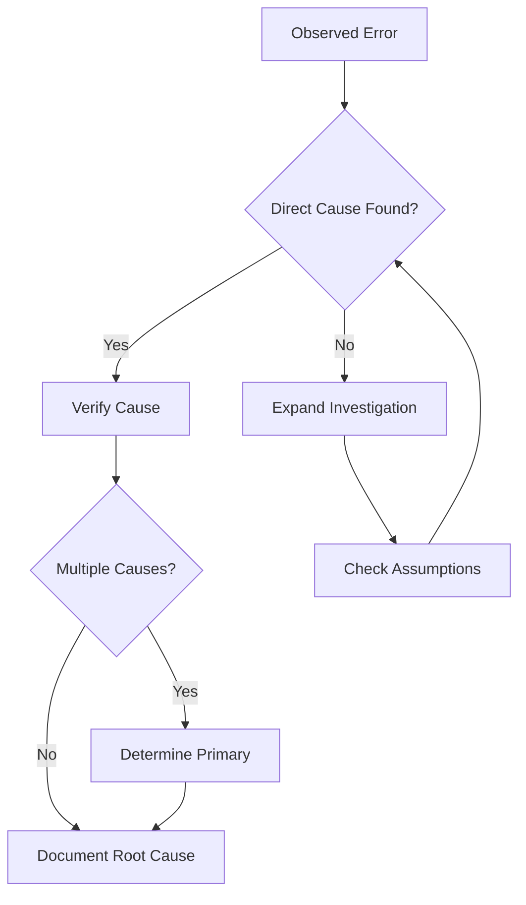

# bug - Root Cause Analysis Command

## Purpose

Perform systematic root cause analysis of errors through forensic investigation.
Focus exclusively on diagnosis and evidence gathering, NOT on fixing issues.

## Investigation Philosophy

1. **Evidence Hierarchy**
   ```
   Priority 1: Error logs and stack traces (direct evidence)
   Priority 2: System state at failure time (contextual evidence)
   Priority 3: Code analysis at error location (implementation evidence)
   Priority 4: Historical patterns (circumstantial evidence)
   ```

2. **Scientific Method**
   - Form hypotheses based on evidence
   - Test hypotheses through investigation
   - Eliminate possibilities systematically
   - Document reasoning transparently

3. **Objectivity Standards**
   - Never assume user's diagnosis is correct
   - Seek disconfirming evidence actively
   - Consider multiple root causes
   - Distinguish correlation from causation

## Input Format

```
Error message or symptom description: $ARGUMENTS
```

## Investigation Protocol

### Stage 1: Initial Triage (2-3 minutes)

**Immediate Actions:**

1. **Parse Error Indicators**
   ```python
   # Extract from $ARGUMENTS:
   - Error type/code
   - File locations mentioned
   - Line numbers
   - Function/method names
   - Timestamps
   - Error messages/descriptions
   ```

2. **Classify Error Category**
   - **Syntax Error**: Code won't parse/compile
   - **Runtime Error**: Execution failure
   - **Logic Error**: Incorrect behavior
   - **Performance Issue**: Slow/timeout
   - **Integration Error**: External service failure
   - **Configuration Error**: Setup/environment issue

3. **Set Investigation Scope**
   ```yaml
   Scope:
     primary_target: [specific file/module]
     search_radius: [related files/modules]
     time_window: [when error started occurring]
     affected_components: [list of systems involved]
   ```

### Stage 2: Log Forensics (CRITICAL - 5-10 minutes)

**Log Investigation Checklist:**

```bash
# 1. Locate all log sources
ls -la logs/ 2>/dev/null || find . -name "*.log" -type f
ls -la /var/log/ 2>/dev/null
ls -la ~/.npm/_logs/ 2>/dev/null  # For Node.js

# 2. Extract error context (last 500 lines)
tail -n 500 [main-log-file] | grep -C 10 -i "error\|exception\|fail"

# 3. Timeline reconstruction
grep -h "2024-" *.log | sort | tail -n 100  # Adjust date

# 4. Pattern analysis
grep -c "ERROR" [log-file]  # Error frequency
grep -o "ERROR.*" [log-file] | sort | uniq -c  # Error types

# 5. Correlation search
grep -A5 -B5 "[specific-error-id]" [log-files]
```

**What to Extract from Logs:**

- **Pre-failure state**: Last successful operations
- **Failure moment**: Exact error with full context
- **Post-failure behavior**: Cascading effects
- **Frequency data**: Is this intermittent or consistent?
- **Environmental factors**: Memory, CPU, disk at failure time

### Stage 3: Code Archaeology (5-10 minutes)

**Systematic Code Investigation:**

1. **Error Site Analysis**
   ```
   Read the exact error location
   ├── Examine 50 lines before/after
   ├── Check all function parameters
   ├── Trace data flow backwards
   └── Identify external dependencies
   ```

2. **Dependency Chain Verification**
   ```
   For each import/require:
   ├── Verify module exists
   ├── Check version compatibility
   ├── Review recent changes
   └── Test assumptions about behavior
   ```

3. **Similar Code Pattern Search**
   ```
   Use Grep to find:
   ├── Similar function calls
   ├── Same error handling patterns
   ├── Related business logic
   └── Test files for this code
   ```

4. **Configuration Audit**
   ```
   Check all config files:
   ├── Environment variables used
   ├── Default vs actual values
   ├── Schema validation
   └── Recent config changes
   ```

### Stage 4: Environmental Analysis (3-5 minutes)

**System State Verification:**

```bash
# Resource availability
df -h  # Disk space
free -m  # Memory (Linux)
ps aux | head -20  # Process list

# Network connectivity
netstat -an | grep LISTEN  # Open ports
curl -I https://api.example.com  # External service check

# Permission issues
ls -la [error-related-files]
whoami && groups  # User context

# Dependency versions
npm list --depth=0  # Node.js
pip freeze  # Python
bundle list  # Ruby
```

### Stage 5: Root Cause Determination

**Causality Analysis Framework:**



**Root Cause Categories:**

1. **Code Defects**
   - Logic errors
   - Off-by-one errors
   - Null/undefined handling
   - Type mismatches

2. **Environmental Issues**
   - Resource exhaustion
   - Permission problems
   - Network failures
   - Version conflicts

3. **Data Problems**
   - Invalid input
   - Corrupted state
   - Race conditions
   - Cache inconsistency

4. **Integration Failures**
   - API changes
   - Protocol mismatches
   - Timeout configurations
   - Authentication failures

## Required Output Format

```markdown
# Root Cause Analysis Report

## Executive Summary
- **Error**: [One-line description]
- **Root Cause**: [Primary cause identified]
- **Confidence**: [0-100]%
- **Severity**: [Critical/High/Medium/Low]

## 📝 Log Analysis

### Critical Log Entries
```
[timestamp] ERROR: [actual error from logs]
[timestamp] INFO: [relevant context]
```

### Timeline of Events
1. [time]: Normal operation observed
2. [time]: First indication of issue
3. [time]: Error manifested
4. [time]: System impact observed

## 🔍 Code Investigation

### Error Location
- **File**: `path/to/file.js:line`
- **Function**: `functionName()`
- **Code**:
```javascript
// Actual code snippet
```

### Problematic Pattern
[Explain why this code fails under certain conditions]

## 🎯 Root Cause Analysis

### Primary Cause
**[Category]: [Specific Issue]**
- Evidence: [Log entry or code that proves this]
- Mechanism: [How this causes the observed error]
- Trigger: [What conditions cause this to occur]

### Contributing Factors
1. [Secondary cause if applicable]
2. [Environmental factor if applicable]

### Eliminated Hypotheses
- ❌ [Hypothesis 1]: Disproved by [evidence]
- ❌ [Hypothesis 2]: Inconsistent with [observation]

## 📊 Analysis Metrics

| Metric | Value | Notes |
|--------|-------|-------|
| **Confidence** | X% | Based on available evidence |
| **Log Coverage** | X% | Percentage of relevant logs analyzed |
| **Code Coverage** | X% | Percentage of suspect code examined |
| **Reproducibility** | Yes/No/Unknown | Can error be reproduced? |

## 🔗 Impact Assessment

### Affected Systems
- [Component 1]: [How it's affected]
- [Component 2]: [How it's affected]

### Failure Conditions
- **Required**: [Conditions that must be present]
- **Frequency**: [How often this occurs]
- **User Impact**: [What users experience]

## 💡 Remediation Strategy (Not Implemented)

### Immediate Mitigation
1. [Quick fix to stop bleeding]

### Permanent Solution
1. [Proper fix approach]
2. [Validation strategy]

### Prevention Measures
1. [How to prevent recurrence]

## ⚠️ Investigation Limitations

- [What wasn't accessible]
- [Assumptions made]
- [Areas needing deeper investigation]

## 📚 Evidence Trail

### Files Examined
- `file1.js:10-50` - [What was checked]
- `logs/error.log:latest` - [What was found]

### Searches Performed
- `grep "ErrorPattern"` - [Results summary]
- `find . -name "*.config"` - [Results summary]
```

## Investigation Decision Tree

```
Start Investigation
├── Error message exists?
│   ├── Yes → Parse error details
│   └── No → Request more information
├── Logs available?
│   ├── Yes → Analyze logs first
│   └── No → Proceed to code analysis
├── Error reproducible?
│   ├── Yes → Document reproduction steps
│   └── No → Focus on historical data
└── Multiple errors?
    ├── Yes → Identify primary vs cascading
    └── No → Deep dive on single error
```

## Quality Gates

Before concluding investigation:

- [ ] Logs have been thoroughly examined
- [ ] Error site code has been analyzed
- [ ] Dependencies have been verified
- [ ] Environmental factors checked
- [ ] Alternative hypotheses tested
- [ ] Evidence supports conclusion
- [ ] Confidence level is justified

## Common Pitfalls to Avoid

❌ **Investigation Anti-patterns:**
- Accepting user's diagnosis without verification
- Focusing only on recent changes
- Ignoring logs in favor of code reading
- Assuming first error is root cause
- Missing cascade effects
- Premature conclusion without evidence

✅ **Best Practices:**
- Start with logs, always
- Question every assumption
- Look for patterns, not just instances
- Consider timing and sequence
- Verify with multiple evidence sources
- Document uncertainty honestly

## Parameters

- `$ARGUMENTS`: Error message, stack trace, or symptom description (required)