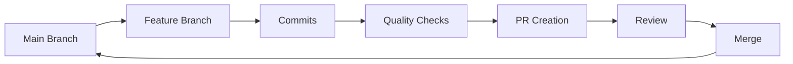

# pr - Pull Request Automation Command

## Purpose

Create high-quality pull requests that reviewers love - with clear context, comprehensive testing, and professional presentation.

## PR Philosophy

### Excellence Standards

1. **Context is King**
   - Every PR tells a complete story
   - Reviewers should understand "why" before "what"
   - Include all information needed for informed review

2. **Quality Before Speed**
   - All checks must pass before PR creation
   - Code follows project conventions perfectly
   - No "fix later" mentality

3. **Respectful of Reviewer Time**
   - Clear, scannable descriptions
   - Logical commit history
   - Pre-answered common questions

## Pre-Flight Checklist

### Stage 1: Change Assessment

```bash
# Understand scope of changes
git status --porcelain | wc -l  # Number of changed files
git diff --stat                 # Summary statistics
git diff --name-only            # List of changed files

# Categorize changes
Changes:
  ├── Features: New functionality added
  ├── Fixes: Bugs resolved
  ├── Refactoring: Code improvements
  ├── Tests: Test coverage changes
  ├── Docs: Documentation updates
  └── Dependencies: Package updates
```

### Stage 2: Quality Gates

```yaml
Required Checks:
  Code Quality:
    - Linting: All style rules pass
    - Formatting: Consistent code style
    - Type Checking: No type errors

  Functionality:
    - Build: Successful compilation
    - Tests: All tests passing
    - Coverage: Meets threshold

  Security:
    - No secrets in code
    - Dependency audit passed
    - SAST checks clean
```

**Quality Gate Implementation:**

```bash
# Type checking
npm run typecheck || yarn typecheck || tsc --noEmit

# Linting
npm run lint || yarn lint || eslint . --fix

# Formatting
npm run format || yarn format || prettier --write .

# Tests
npm test || yarn test || jest

# Build
npm run build || yarn build

# Security audit
npm audit || yarn audit
```

### Stage 3: Branch Strategy



**Branch Naming Conventions:**

```
feature/[ticket-id]-brief-description
bugfix/[ticket-id]-issue-fixed
refactor/component-name
docs/what-documented
test/what-tested
perf/optimization-area
```

## Commit Management

### Commit Message Format

```
<type>(<scope>): <subject>

<body>

<footer>
```

**Types:**
- `feat`: New feature
- `fix`: Bug fix
- `refactor`: Code refactoring
- `docs`: Documentation
- `test`: Testing
- `perf`: Performance
- `chore`: Maintenance

**Example:**
```
feat(auth): implement JWT refresh token rotation

- Add refresh token generation on login
- Implement secure token storage
- Add automatic token refresh middleware
- Include revocation mechanism

Closes #123
```

### Commit Organization Strategies

**Strategy 1: Logical Grouping**
```bash
# Group related changes
git add src/components/Button.*
git commit -m "refactor(ui): modernize Button component"

git add src/components/Form.*
git commit -m "refactor(ui): modernize Form component"
```

**Strategy 2: Feature Progression**
```bash
# Show implementation journey
git commit -m "feat(api): add user endpoint structure"
git commit -m "feat(api): implement user validation"
git commit -m "feat(api): add user persistence"
git commit -m "test(api): add user endpoint tests"
```

**Strategy 3: Atomic Changes**
```bash
# One logical change per commit
git commit -m "fix(auth): correct token expiry calculation"
git commit -m "test(auth): add token expiry test cases"
git commit -m "docs(auth): update token lifecycle documentation"
```

## PR Description Template

```markdown
## 🎯 Purpose

[1-2 sentences explaining WHY this change is needed]

## 📝 Description

### What Changed
[Bullet points of key changes]
-
-
-

### Implementation Approach
[Brief explanation of HOW you solved the problem]

## 🔄 Type of Change

- [ ] 🐛 Bug fix (non-breaking change fixing an issue)
- [ ] ✨ New feature (non-breaking change adding functionality)
- [ ] 💥 Breaking change (fix or feature causing existing functionality to change)
- [ ] 🔧 Refactor (code change that neither fixes a bug nor adds a feature)
- [ ] 📝 Documentation (documentation changes only)
- [ ] 🚀 Performance (performance improvements)
- [ ] ✅ Test (test additions or corrections)

## 📸 Screenshots/Recordings

[If applicable, add screenshots or recordings showing the change]

<details>
<summary>Before</summary>

[Screenshot/description of previous state]

</details>

<details>
<summary>After</summary>

[Screenshot/description of new state]

</details>

## 🧪 Testing

### Test Coverage
- [ ] Unit tests added/updated
- [ ] Integration tests added/updated
- [ ] E2E tests added/updated

### Manual Testing Steps
1. [Step to test feature]
2. [Another step]
3. [Expected result]

### Test Results
```
[Paste test run output showing all tests passing]
```

## ✅ Checklist

### Code Quality
- [ ] My code follows the project's style guidelines
- [ ] I have performed a self-review of my own code
- [ ] I have commented my code, particularly in hard-to-understand areas
- [ ] My changes generate no new warnings

### Documentation
- [ ] I have updated relevant documentation
- [ ] I have updated the README if needed
- [ ] I have added/updated JSDoc comments where appropriate

### Testing
- [ ] New and existing unit tests pass locally
- [ ] I have added tests that prove my fix/feature works
- [ ] Test coverage has not decreased

### Dependencies
- [ ] I have updated dependencies responsibly
- [ ] No unnecessary dependencies were added
- [ ] Security audit passes for any new dependencies

## 🔗 Related Issues

Closes #[issue number]
Related to #[other issue numbers]

## 🚀 Deployment Notes

[Any special deployment considerations]
- Database migrations required: Yes/No
- Environment variables added: Yes/No
- Breaking changes: Yes/No

## 📊 Performance Impact

[If applicable]
- Load time impact: +/-X ms
- Memory usage: +/-X MB
- API response time: +/-X ms

## 🤔 Questions for Reviewers

1. [Specific question about approach]
2. [Area where you'd like particular attention]

## 📚 References

- [Link to design document]
- [Link to related discussion]
- [Link to external documentation]

---

**Reviewer Tips:**
- Start with [specific file] for context
- Pay special attention to [area of concern]
- [Any other guidance for reviewers]
```

## Automation Workflow

### Complete PR Creation Flow

```bash
#!/bin/bash

# 1. Analyze changes
echo "📊 Analyzing changes..."
CHANGED_FILES=$(git diff --name-only)
CHANGE_STATS=$(git diff --stat)

# 2. Determine change type
if echo "$CHANGED_FILES" | grep -q "^src/"; then
    CHANGE_TYPE="feature"
elif echo "$CHANGED_FILES" | grep -q "^test/"; then
    CHANGE_TYPE="test"
elif echo "$CHANGED_FILES" | grep -q "^docs/"; then
    CHANGE_TYPE="docs"
else
    CHANGE_TYPE="chore"
fi

# 3. Generate branch name
BRANCH_NAME="${CHANGE_TYPE}/$(date +%Y%m%d)-${RANDOM}"
echo "🌿 Creating branch: $BRANCH_NAME"
git checkout -b "$BRANCH_NAME"

# 4. Run quality checks
echo "✅ Running quality checks..."
npm run lint:fix
npm run format
npm run typecheck
npm run test

# 5. Commit changes
echo "📝 Creating commits..."
git add -A
git commit -m "${CHANGE_TYPE}: $(echo $CHANGE_SUMMARY)"

# 6. Push branch
echo "⬆️ Pushing branch..."
git push -u origin "$BRANCH_NAME"

# 7. Create PR
echo "🎯 Creating pull request..."
gh pr create \
  --title "[${CHANGE_TYPE}] ${PR_TITLE}" \
  --body "$(cat pr-description.md)" \
  --base "${BASE_BRANCH:-main}" \
  ${DRAFT_FLAG}

echo "✨ Pull request created successfully!"
```

## PR Review Optimization

### Making PRs Review-Friendly

**Size Guidelines:**
```yaml
Ideal PR Size:
  Files Changed: < 10
  Lines Changed: < 400
  Commits: 1-5

When to Split PRs:
  - Independent features
  - Separate concerns (backend/frontend)
  - Refactoring vs new functionality
```

**Review Aids:**

1. **Inline Comments**
```javascript
// PR Note: This replaces the previous implementation
// because [reason]. See issue #123 for context.
```

2. **Commit Messages as Documentation**
```
Each commit should tell part of the story
→ Reviewer can understand progression
→ Easy to identify where issues might be
```

3. **Self-Review Comments**
```markdown
Post PR creation, add comments:
- Explaining complex logic
- Highlighting important changes
- Asking for specific feedback
```

## GitHub CLI Integration

### Advanced gh Commands

```bash
# Create draft PR
gh pr create --draft \
  --title "WIP: Feature implementation" \
  --body-file .github/pull_request_template.md

# Create PR with labels
gh pr create \
  --label "enhancement,needs-review" \
  --assignee "@me" \
  --reviewer "team-lead,senior-dev"

# Create PR with milestone
gh pr create \
  --milestone "v2.0" \
  --project "Sprint 15"

# Auto-fill from commit messages
gh pr create --fill

# Interactive PR creation
gh pr create --web
```

## Quality Metrics

### PR Health Indicators

```yaml
Excellent PR:
  ✓ All checks passing
  ✓ Clear description
  ✓ Appropriate size
  ✓ Logical commits
  ✓ No merge conflicts
  ✓ Responsive to feedback

Warning Signs:
  ⚠ Too many files changed
  ⚠ Mixed concerns
  ⚠ Unclear description
  ⚠ Failing checks
  ⚠ No tests included
  ⚠ Large refactor with features
```

## Troubleshooting

### Common Issues and Solutions

**Issue: Merge Conflicts**
```bash
# Update branch with latest base
git fetch origin
git rebase origin/main
# Resolve conflicts
git add .
git rebase --continue
git push --force-with-lease
```

**Issue: Failing Checks**
```bash
# Run checks locally first
npm run pre-commit
# Fix issues
npm run lint:fix
npm run format:write
# Amend commit
git add .
git commit --amend --no-edit
git push --force-with-lease
```

**Issue: PR Too Large**
```bash
# Split into multiple PRs
git checkout main
git checkout -b feature/part-1
git cherry-pick <commits-for-part-1>
git push -u origin feature/part-1
gh pr create --title "Part 1: Foundation"

git checkout main
git checkout -b feature/part-2
git cherry-pick <commits-for-part-2>
git push -u origin feature/part-2
gh pr create --title "Part 2: Implementation"
```

## Best Practices

### DO:
- ✅ Keep PRs focused on a single concern
- ✅ Write descriptive PR titles and descriptions
- ✅ Include tests with new features
- ✅ Update documentation alongside code
- ✅ Respond to review comments promptly
- ✅ Use draft PRs for work-in-progress
- ✅ Link to related issues and discussions

### DON'T:
- ❌ Mix refactoring with new features
- ❌ Submit PRs with failing tests
- ❌ Force push after review starts (use new commits)
- ❌ Include generated files unless necessary
- ❌ Leave TODO comments without issues
- ❌ Ignore PR template sections
- ❌ Submit massive PRs without prior discussion

## Parameters

- `$ARGUMENTS`: Optional PR description or context
- `--base_branch`: Target branch for merge (default: main/master)
- `--draft`: Create as draft PR (default: false)
- `--type`: Change type classification