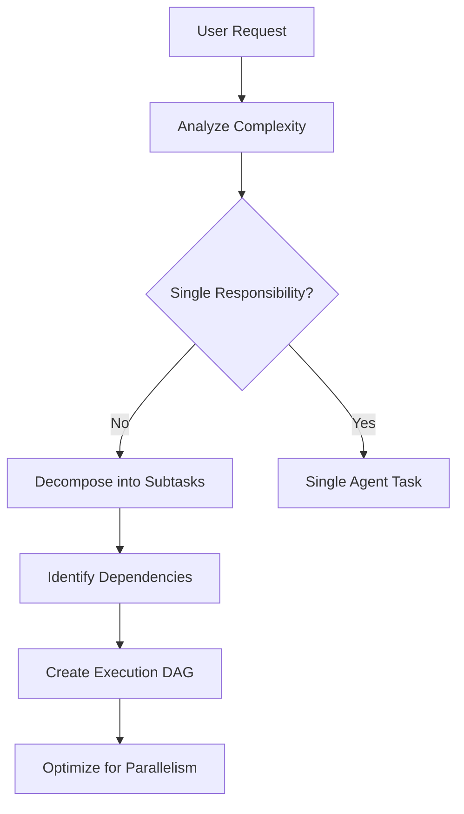

# execute - Task Orchestration Command

## Purpose

Transform high-level requirements into completed implementations through strategic task decomposition and parallel execution using specialized subagents.

## Orchestration Philosophy

### Core Principles

1. **Delegation Over Direct Execution**
   - Act as architect and coordinator, not implementer
   - Leverage specialized agents for optimal results
   - Maintain high-level oversight while agents handle details

2. **Parallelization First**
   - Identify independent work streams
   - Execute non-blocking tasks concurrently
   - Minimize critical path duration

3. **Clear Communication**
   - Provide comprehensive context to each agent
   - Define explicit success criteria
   - Include all necessary constraints and requirements

## Task Analysis Framework

### Step 1: Decomposition Strategy



### Step 2: Dependency Mapping

**Dependency Types:**
- **Hard Dependencies**: Task B cannot start until Task A completes
- **Soft Dependencies**: Task B benefits from Task A but can proceed
- **Resource Dependencies**: Tasks compete for same resources
- **Output Dependencies**: Multiple tasks contribute to single output

**Dependency Resolution:**
```python
# Pseudo-code for task ordering
tasks = identify_all_tasks(request)
dependencies = map_dependencies(tasks)
execution_waves = []

while unscheduled_tasks:
    wave = [task for task in unscheduled_tasks
            if all_dependencies_met(task, completed_tasks)]
    execution_waves.append(wave)
    completed_tasks.extend(wave)
    unscheduled_tasks.remove(wave)
```

### Step 3: Agent Selection

**Agent Type Matrix:**

| Task Type | Primary Agent | Fallback Option |
|-----------|--------------|-----------------|
| Code Investigation | serena + general-purpose | Grep + Read tools |
| Implementation | coding-expert | general-purpose |
| Testing | test | general-purpose |
| Documentation | docs | general-purpose |
| Refactoring | refactor | coding-expert |
| Security Analysis | security | general-purpose |
| Performance | performance | general-purpose |

## Execution Strategies

### Strategy 1: Parallel Investigation
```yaml
When: Multiple unknowns need clarification
Approach:
  - Launch multiple investigation agents simultaneously
  - Each investigates different aspect
  - Synthesize findings for implementation plan
Example:
  - Agent 1: Investigate existing authentication
  - Agent 2: Research best practices for JWT
  - Agent 3: Analyze current security requirements
```

### Strategy 2: Pipeline Processing
```yaml
When: Output of one task feeds into next
Approach:
  - Chain agents in sequence
  - Each agent's output becomes next agent's input
  - Include validation between stages
Example:
  - Agent 1: Generate API specification
  - Agent 2: Implement based on specification
  - Agent 3: Create tests for implementation
```

### Strategy 3: Divide and Conquer
```yaml
When: Large feature with independent components
Approach:
  - Split by architectural boundaries
  - Assign specialist agent to each component
  - Coordinate integration points
Example:
  - Agent 1: Frontend UI implementation
  - Agent 2: Backend API development
  - Agent 3: Database schema design
```

### Strategy 4: Iterative Refinement
```yaml
When: Complex logic requiring validation
Approach:
  - Initial implementation agent
  - Review/validation agent
  - Refinement agent based on feedback
  - Repeat until quality threshold met
Example:
  - Agent 1: Implement algorithm
  - Agent 2: Performance analysis
  - Agent 3: Optimize based on analysis
```

## Agent Instruction Template

```markdown
## Task: [Specific Task Name]

### Context
- **Project**: [Project description]
- **Current State**: [What exists now]
- **Dependencies**: [What this task depends on]
- **Constraints**: [Technical/business limitations]

### Objective
[Clear, measurable goal for this agent]

### Requirements
1. [Specific requirement 1]
2. [Specific requirement 2]
3. [Use serena MCP for code navigation]
4. [Use context7 MCP for framework documentation]

### Success Criteria
- [ ] [Measurable outcome 1]
- [ ] [Measurable outcome 2]
- [ ] [All tests pass]
- [ ] [No linting errors]

### Deliverables
- [Expected output 1]
- [Expected output 2]

### Important Notes
- [Critical information]
- [Potential gotchas]
- [Integration points]
```

## Quality Control Protocol

### Pre-Delegation Checklist
- [ ] Task scope is clearly defined
- [ ] Success criteria are measurable
- [ ] Dependencies are identified
- [ ] Appropriate agent type selected
- [ ] Context includes all necessary information
- [ ] MCP tool usage instructions included

### Post-Execution Validation
- [ ] All success criteria met
- [ ] Code follows project conventions
- [ ] Tests are passing
- [ ] Documentation updated if needed
- [ ] No regression in existing functionality
- [ ] Performance benchmarks maintained

## Coordination Patterns

### Pattern 1: Information Gathering First
```
Phase 1: Parallel Investigation
├── Agent A: Analyze existing code
├── Agent B: Research requirements
└── Agent C: Identify constraints

Phase 2: Synthesis
└── Combine findings into implementation plan

Phase 3: Parallel Implementation
├── Agent D: Core functionality
├── Agent E: Tests
└── Agent F: Documentation
```

### Pattern 2: Incremental Building
```
Wave 1: Foundation
└── Agent A: Set up base structure

Wave 2: Core Features (parallel)
├── Agent B: Feature 1
├── Agent C: Feature 2
└── Agent D: Feature 3

Wave 3: Integration
└── Agent E: Connect components

Wave 4: Polish (parallel)
├── Agent F: Optimization
├── Agent G: Error handling
└── Agent H: Documentation
```

### Pattern 3: Test-Driven Orchestration
```
Step 1: Test Definition
└── Agent A: Create test specifications

Step 2: Parallel Implementation
├── Agent B: Implement to pass tests
└── Agent C: Create integration tests

Step 3: Validation
└── Agent D: Run all tests and validate
```

## Communication Standards

### Inter-Agent Communication
When agents need to share information:

```yaml
From Agent A to Agent B:
  Status: [Completed/Partial/Blocked]
  Output:
    - [Key finding 1]
    - [Key finding 2]
  Integration Points:
    - [Where Agent B should connect]
  Warnings:
    - [Potential issues to watch]
```

### Progress Reporting
Regular status updates should include:

```markdown
## Execution Status

### Completed Tasks
- ✅ [Task 1]: [Brief outcome]
- ✅ [Task 2]: [Brief outcome]

### In Progress
- 🔄 [Task 3]: [Current status, ETA]
- 🔄 [Task 4]: [Current status, ETA]

### Queued
- ⏳ [Task 5]: [Waiting for: dependency]
- ⏳ [Task 6]: [Scheduled for: wave 3]

### Blockers
- 🚫 [Issue]: [What's needed to unblock]
```

## Error Recovery Strategies

### When Agent Fails

```python
if agent_failure:
    analyze_failure_reason()

    if missing_context:
        augment_instructions()
        retry_with_same_agent()

    elif wrong_agent_type:
        select_appropriate_agent()
        restart_task()

    elif partial_success:
        extract_completed_work()
        create_continuation_task()
        delegate_to_new_agent()

    else:
        escalate_to_user()
```

### Common Failure Patterns

1. **Insufficient Context**
   - Solution: Add more specific examples
   - Include file paths and function names
   - Provide sample code patterns

2. **Scope Creep**
   - Solution: Break into smaller tasks
   - Define explicit boundaries
   - Add "do not do" instructions

3. **Integration Conflicts**
   - Solution: Add synchronization point
   - Define clear interfaces
   - Include integration tests

## Optimization Techniques

### Maximize Parallelism
```yaml
Instead of:
  Task A → Task B → Task C → Task D

Consider:
  Parallel Group 1: [Task A, Task C]
  Parallel Group 2: [Task B, Task D]
  (if dependencies allow)
```

### Minimize Context Switching
```yaml
Group related tasks:
  Agent 1: All database tasks
  Agent 2: All API tasks
  Agent 3: All UI tasks

Rather than:
  Agent 1: Database task 1 + API task 1
  Agent 2: UI task 1 + Database task 2
```

### Batch Similar Operations
```yaml
Efficient:
  Agent 1: Refactor all controllers

Less efficient:
  Agent 1: Refactor controller A
  Agent 2: Refactor controller B
  Agent 3: Refactor controller C
```

## Best Practices

### DO:
- ✅ Provide complete context upfront
- ✅ Define clear boundaries between tasks
- ✅ Include validation steps
- ✅ Specify tool usage (serena, context7)
- ✅ Set measurable success criteria
- ✅ Plan for failure scenarios
- ✅ Document integration points

### DON'T:
- ❌ Micromanage agent implementation details
- ❌ Create circular dependencies
- ❌ Forget to specify code style requirements
- ❌ Omit error handling requirements
- ❌ Assume agents know project conventions
- ❌ Skip validation phases
- ❌ Leave success criteria vague

## Parameters

- `$ARGUMENTS`: High-level task or feature to implement (required)